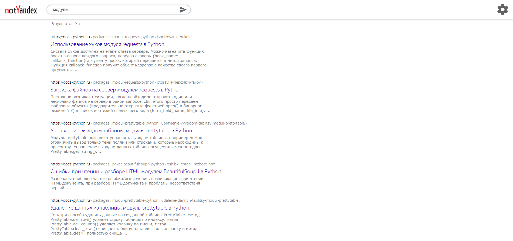

## Показ результатов

### Верхний блок
В верхнем блоке в правом верхнем углу находится кнопка для перехода в 
настройки. В левом углу находится логотип, при нажатии на него будет
возврат на главную страницу. Также есть поле для ввода нового запроса. 
Если пользователь уже делал какие-либо запросы, 
они будут отображаться снизу поля ввода (максимум их будет 8). Для отправки
запроса нужно либо нажать `Enter`, либо нажать на стрелку.
### Основной блок
Если результаты для данного запроса есть, показывается количество этих
 результатов. Если же результатов нет, отображается сообщение 
 "По запросу <название запроса> ничего не найдено". Если в запросе 
 присутствовали грамматические ошибки, то пользователю будет сообщаться,
 что поиск производился по исправленному запросу и даваться возможность 
 искать по запросу с ошибками. После этого отображаются результаты:
 ссылка на результат, разложеная как путь от главной страницы; название
 сайта с ссылкой на этот сайт; текст из данного сайта. Максимальное 
 количество отображаемых результатов: 35.