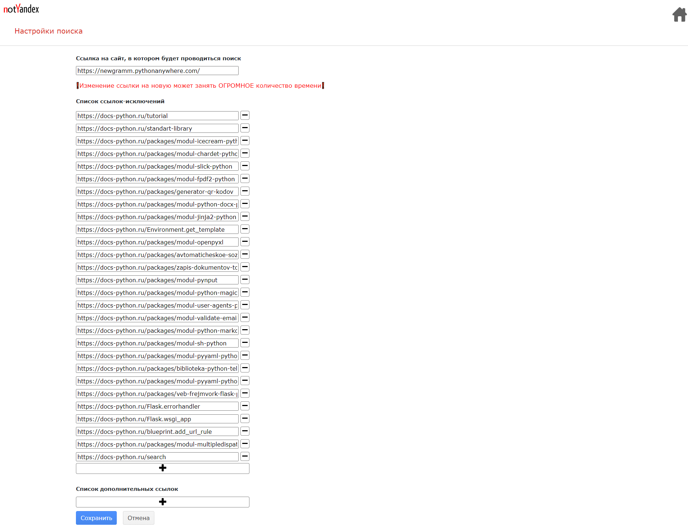

## Настройки

### Верхний блок
В верхнем блоке в правом верхнем углу находится кнопка возврата на главную
страницу. В левом углу находится логотип, при нажатии на него тоже будет
возврат на главную страницу. 
### Основной блок
Сначала идёт поле для ввода ссылки. При некорректной ссылке будет 
высвечиваться специальное сообщение. Далее идёт 2 специальных раздела,
позволяющих добавлять или удалять ссылки-исключения и ссылки-дополнения.
Пустые поля ввода в этих разделах будут игнорироваться. Кнопки сохранить и
отмена, соответственно, сохряняют изменения и отменяют их.